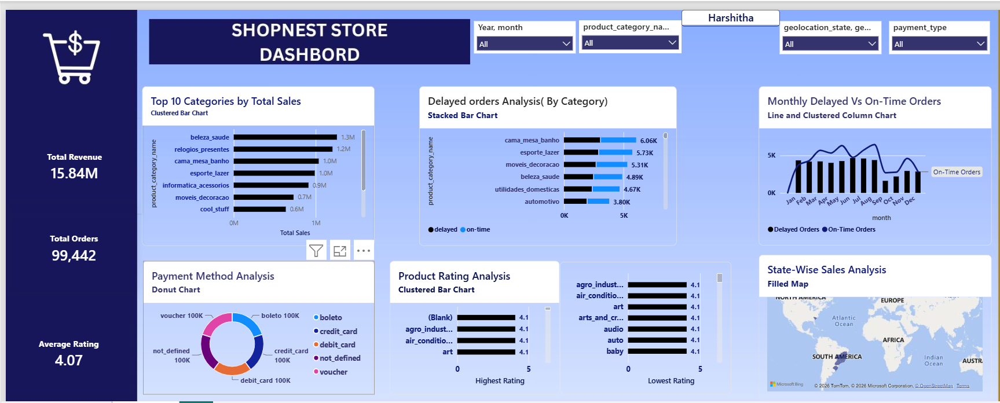

# Data Analytics Projects

Data Analytics projects using Python, Power BI, SQL and Excel.

## Projects

### 1. Employee & Project Data Analysis – Python

- Analyzed employee and project data using Python and Pandas.
- Cleaned missing values and transformed datasets.
- Merged project, employee and seniority datasets.
- Calculated project costs, employee changes and designation changes.
- Dataset included 14 projects and 5 employees.
- Classified projects into 7 finished, 4 ongoing and 3 failed projects.
- Calculated total project cost of ₹26.39 million.

**Tools:** Python, Pandas, Data Cleaning, Data Transformation

### 2. E-Commerce Sales & Customer Analytics Dashboard – Power BI

- Built an interactive Power BI dashboard for e-commerce sales and customer analysis.
- Analyzed revenue, orders, product categories, customer locations, ratings, delivery status and payment methods.
- Created KPIs, charts, slicers and a state-wise sales map.
- Key metrics include ₹15.84M total revenue, 99,442 total orders and 4.07 average rating.

**Tools:** Power BI, DAX, Data Visualization

 # data-analytics-projects
Data Analytics projects using Python, Power BI, SQL and Excel
